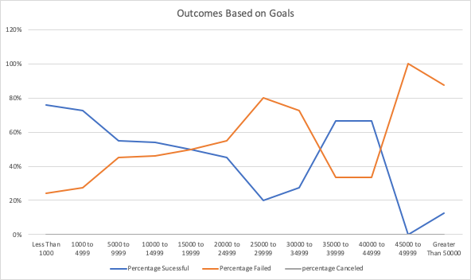

# Kickstarter Analysis with Excel

## Overview of Project

### Purpose
The purpose of this analysis is to help our friend, Louise, figure out the relationships between campaigns outcomes with their funding goals and launch dates with our Kickstarter dataset. 

## Analysis and Challenges

### Analysis of Outcomes Based on Launch Date
To find out if there were any relations between outcomes based on a campaign's launch date, I first checked my dataset to see if I had all the necessary data needed to perform an analysis. I have created a new column from the years extracted from the "Date Created Conversion" column. Then, I began my analysis by creating a pivot table with filters for Years and Parent Category. The pivot table fields have Outcomes in the columns field, Date Created Conversion in the rows field and count of Outcomes in the values field. I was able to filter the Parent Category to show 'theater' and row labels to show the months of the year. The columns of the pivot table also showed the number of successful, failed, canceled and grand total of theater campaigns according to the respected month. In the picture below, I created a line chart based on the pivot table I just created. It shows the number of successful, failed and canceled campaigns by month. 

### Analysis of Outcomes Based on Goals
To perform an analysis of outcomes based on goals, I first created a chart to show the range of goals starting from less than $1000, $1000 to $4999, $5000 to $9999 and so forth in this pattern. Next, I found the number of successful, failed and canceled campaigns categorized as a play. To do this, I used the COUNTIFS() formula on excel. After finding these numbers, I turned it into a percentage and plotted a line chart to see which range of goals have a higher or lower successful, failed or canceled percentage. In the picture below, we can see that the blue line shows percentage successful, orange shows percentage failed and gray shows percentage canceled. 
	

### Challenges and Difficulties Encountered
Some challenges that came along while performing these analyses was the use of new formulas in excel and selecting the correct dataset. One particular formula that was difficult to understand was the COUNTIFS() formula. To count each number, I had to make sure that all criteria were listed. I also had to make sure I was using the correct data and range. To overcome the challenge, I made a list of criteria that needed to be met. For example, some criteria were successful, failed, canceled, plays, and then the range was also very specific. Another way to visualize this was the tutorial linked in the module. The step by step instruction added to my knowledge of the COUNTIFS() formula. 

## Results

- What are two conclusions you can draw about the Outcomes based on Launch Date?

There are two conclusions that I can draw about the Outcomes based on Launch Date. Based on the line chart, I can see that the month of May has a peak successful number. My conclusion is that the months May and June are the best time to launch a campaign. I also see that December has the lowest successful number. The conclusion is that December is not a good month to launch a campaign. 
	
- What can you conclude about the Outcomes based on Goals?

From my analysis about Outcomes based on Goals, I can see that there is no direct relationship between the two variables. The line chart has a percentage successful line that fluctuates up and down as goals increases. 

- What are some limitations of this dataset?

There are some limitations to this dataset. One limitation was the lack of data for recent years. In order to see how campaigns are performing, it would be best to have data from recent years to account for changes in audience's preference and competition in the market. Another limitation would be the accuracy of the goals and pledged amount. Since there were many countries and difference currencies, the numbers might not be consistent. 

- What are some other possible tables and/or graphs that we could create?

A possible table that we could create is a pivot table showing Outcomes in the columns field, Percentage Funded in the rows field, Counts of Outcomes in values field and a filter for Parent Category. This pivot table will allow us to filter out the category of campaign we wish to look at. Additionally, it will also show how the percentage funded relates to how successful or unsuccessful a campaign was. Another table we can look at is the relation between Backers Count vs. Outcome. By using VLOOKUP on a new spreadsheet, we can pick out each campaign name, its backers count and whether it was a successful, failed or canceled campaign. 
